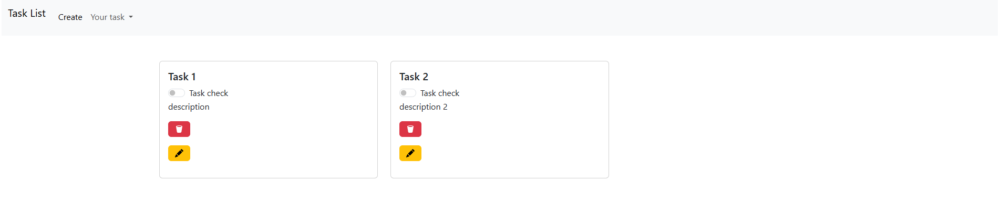

## TASK APPLICATION

### REQUIREMENTS
1. Install Node.js and npm.
2. Install Express framework.
3. Install MySQL database.

### DESCRIPTION
This application is a task list that supports CRUD (Create, Read, Update, Delete) operations. Users can manage their tasks through an intuitive interface.

The application features a checkbox for each task to mark its completion status. Additionally, it includes a counter that displays the number of tasks that are completed and the number of tasks that are not completed.

Here is a visual preview of the application:

The interface updates dynamically, ensuring users can easily track and manage their tasks in real-time.

Here is another preview showing the task completion counters:
